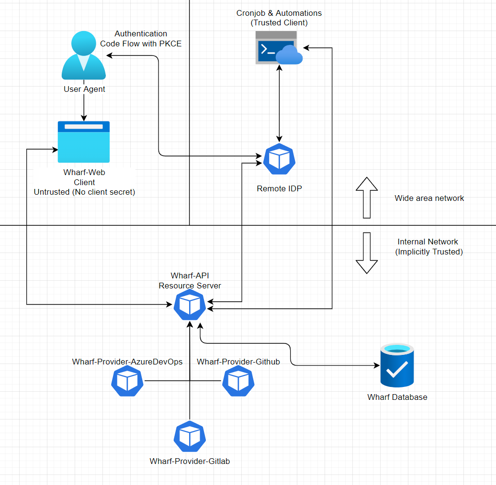

# {{page.title}}

- RFC PR: [iver-wharf/rfcs#{{page.pr_id}}](https://github.com/iver-wharf/rfcs/pull/{{page.pr_id}})
- Feature name: `{{page.rfc_feature_name}}`
- Author: {{page.rfc_author_name}} ([@{{page.rfc_author_username}}](https://github.com/{{page.rfc_author_username}}))
- Implementation issue: [{{page.impl_issue_repo}}#{{page.impl_issue_id}}](https://github.com/{{page.impl_issue_repo}}/issues/{{page.impl_issue_id}})
- Implementation status: 

## Summary

Wharf should have authentication. Wharf currently has no authentication.
This RFC will outline a plan to implement OpenID Connect (OIDC) in Wharf.
The plan shall be limited to authentication and authorization with
OIDC. User and group management will be offloaded onto the Identity provider
this requires using Identity providers which embrace the concept of
Role-Based Access Control. The initial implementation will also be limited
to only sourcing from 1 identity provider at a time, it will however be
possible to extend this to multiple different sources later.

## Dictionary

- OIDC - [OpenID Connect (OIDC)](https://openid.net/connect)

- IDP - Identity provider - some examples include
  [Google Workspace](https://workspace.google.com/intl/sv),
  [Azure AD](https://azure.microsoft.com/en-us/services/active-directory), and
  [Auth0/Okta](https://www.okta.com/)

- RBAC - [Role-Based Access Control](https://auth0.com/docs/authorization/rbac/)

- Issuer - In this RFC this refers to the issuer field in a OIDC metadata
  sheet. The issuer is an authority for validating JWTs used in OIDC.

## Motivation

Some claim a good feature of secure infrastructure is access control. Currently,
our only solution is network isolation. Being able to restrict access to varying
degrees is also a product goal to satisfy business needs.

Tying the user management of wharf to central repositories such as
organisation wide IDPs is good for a number of reasons.

- Centrally managed on/off boarding:

  - Leads to less administration

  - Role-based security inheritance allows automatic updates of user access
    levels

- Piggybacking on existing password and user recovery routines results in a
  DRY style system architecture

- Near perfectly mirrored compliance with top level organisational
  security levels

## Explanation

By using the OIDC standard an authentication & authorisation system will be
built in a minimalist fashion that offloads most of the work involved in
administration to other pre-existing platforms.

### The Access Token

A OIDC type access token can be used for authentication. The custom claims
(requires an IDP with support for RBAC) can be used to specify access levels.
To keep the scope manageable the task of dividing up and refining access
levels and permission will be left to a later date. For this RFC all kinds
of read permissions won't require valid tokens, but all write type requests
will require valid ID-tokens that have been signed by a pre-approved issuer.
The OIDC protocol defines a token called an
[Access Token](https://auth0.com/docs/security/tokens/access-tokens).
The access token is signed by the source issuer. This signature is then used to
validate the token. See
[validating an OIDC Access Token](https://auth0.com/docs/security/tokens/access-tokens/validate-access-tokens).

### Session Management

The wharf-api is currently stateless and does not use sessions. To keep this
design tokens will be sent in every request to the server.

The option of introducing sessions as a way to store tokens may be reconsidered
at a later point. There seems to be a potential performance gain.

### Local development vs production environments

For the initial release of the feature the configuration will be tailored to
using azure as an IDP. These settings will as necessary be exposed as
environment variables to each respective docker image.

For use in offline developer environments it should be possible to switch on a
developer mode switch that allows bypassing validation of access
tokens such that a valid login is not required.

### SSL Config Required as a part of OIDC

For OIDC ssl is required. In order to avoid having to fill the development
environment with --force-unsecure SSL certs will be inserted into the traefik
config and generated with openSSL as part of the repo setup.

### Choice of Client

The OIDC standard defines a
[list of certified clients](https://openid.net/developers/certified/)
that can help simplify the implementation of ID Token retrieval.

For the frontend, <https://github.com/damienbod/angular-auth-oidc-client>
will be used.

For the backend a full client will not be required. As the tokens just need
to be validated and not requested. See
[validating an access token](https://auth0.com/docs/security/tokens/access-tokens/validate-access-tokens)

## Compatibility

Expect no compatibility between versions of wharf without authentication to
versions of wharf with authentication. There is a potential threat in leaving
the system backwards compatible in that a non-secured version of the api could
run together in an otherwise secure cluster.

We should aim to pick a solution where any IDP supporting OIDC and RBAC can be
used. Locking ourselves to a single IDP when a standard such as OIDC exists
seems like a wasted opportunity. Keeping the choice of IDP open will leave
more room for choice and flexibility in the future.

## Alternative solutions

There are many types of identity verification systems.
This RFC assumes that OIDC will be used. Within OIDC there are multiple
different [flow definitions](https://developer.okta.com/docs/concepts/oauth-openid/#choosing-an-oauth-2-0-flow).
We will use `codeflow with pkce` as this is presumed to be the
most secure at the time of writing.

## Future possibilities

We may want to implement multiple different IDP sources. This could allow
login from different IDPs. A sample situation where this could be useful is
when an external third party should be granted view or admin rights to the
deployment pipeline.

When handling tokens from RBAC enabled IDPs it's possible to verify
custom permission levels using custom role claims.
[See this link](https://docs.microsoft.com/en-us/azure/role-based-access-control/custom-roles)
for more information about custom claims. This system allows for setup
fine-tuned access control on a per-deployment basis. The initial setup
for each RBAC system will require setup on a per-provider basis as it
requires interaction directly with each respective IDP on a
non-oidc-standard basis.

## Unresolved questions
