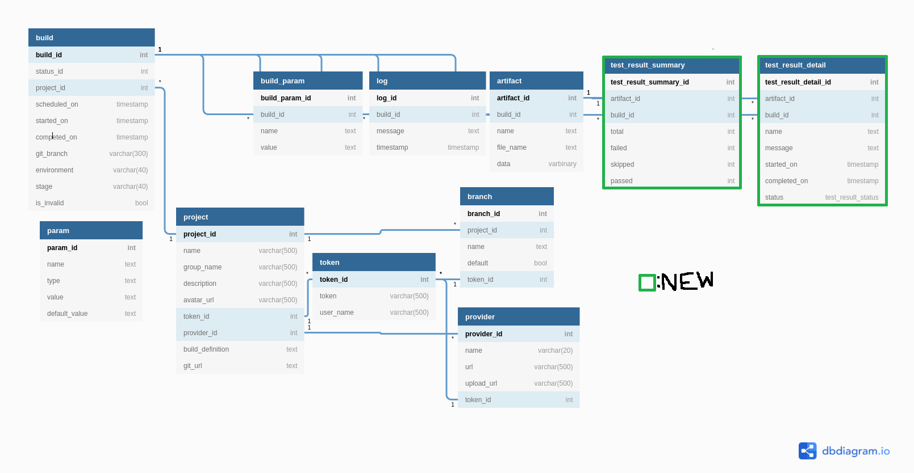

# {{page.title}}

- RFC PR: [iver-wharf/rfcs#{{page.pr_id}}](https://github.com/iver-wharf/rfcs/pulls/{{page.pr_id}})
- Feature name: `{{page.rfc_feature_name}}`
- Author: {{page.rfc_author_name}} ([@{{page.rfc_author_username}}](https://github.com/{{page.rfc_author_username}}))
- Implementation issue: [{{page.impl_issue_repo}}#{{page.impl_issue_id}}](https://github.com/{{page.impl_issue_repo}}/issues/{{page.impl_issue_id}})
- Implementation status: 

## Summary

The intent is to avoid filtering and parsing test result files (TRX)
from the generated artifacts each time we want to display them or a
summary.

In addition, we want to display the test result summary in the builds list.

We also want the ability to display more detailed test results. For this, we
will store the messages that the tests produce, as well their names. At the
very least for failed tests.

## Motivation

The Status field in wharf-web's project view (Failed/Completed)
currently calls an endpoint that asks the server to fetch all TRX files
for the build, and take the most recent one. Then it parses the file to
see how many failed/completed tests there were.
It does this for every build in the view, every time it is refreshed.
This leads to unnecessary requests and computation. This, in turn, slows
down the response times and increases the API load.

Showing the tests' outcomes ( :heavy_check_mark:/:large_orange_diamond:/:x: )
of the tests in the builds list also makes it easier to navigate for the
end-user. It is likely beneficial to include the amounts of each outcome here
as well.

Having the tests' error messages is also pretty much a necessity when trying
to fix them. Currently, there is no way to ask the API for them.

## Related GitHub issues

- wharf-api [#11](https://github.com/iver-wharf/wharf-api/issues/11) [#17](https://github.com/iver-wharf/wharf-api/issues/17)
- wharf-web [#13](https://github.com/iver-wharf/wharf-web/issues/13)

## Explanation

### wharf-api

The `POST /build/{buildid}/artifact` endpoint handles inserting artifacts, same
as before. However, if it's a test results file (eg: .trx), one should call the
`POST /build/{buildid}/test-results` endpoint instead. This tells the server
to parse them as well, creating several `TestResultDetail`s and one `TestResultSummary`
per TRX file.

The summaries get inserted into the database table `test_result_summary`.\
The results get inserted into the database table `test_result_detail`.



#### New or modified database models

```diff
// database_models.go
type Build struct {
  BuildID     uint         `gorm:"primaryKey" json:"buildId"`
  StatusID    BuildStatus  `gorm:"not null" json:"statusId"`
  ProjectID   uint         `gorm:"not null;index:build_idx_project_id" json:"projectId"`
  Project     *Project     `gorm:"foreignKey:ProjectID;constraint:OnUpdate:RESTRICT,OnDelete:RESTRICT" json:"-"`
  ScheduledOn *time.Time   `gorm:"nullable;default:NULL" json:"scheduledOn" format:"date-time"`
  StartedOn   *time.Time   `gorm:"nullable;default:NULL" json:"startedOn" format:"date-time"`
  CompletedOn *time.Time   `gorm:"nullable;default:NULL" json:"finishedOn" format:"date-time"`
  GitBranch   string       `gorm:"size:300;default:'';not null" json:"gitBranch"`
  Environment null.String  `gorm:"nullable;size:40" json:"environment" swaggertype:"string"`
  Stage       string       `gorm:"size:40;default:'';not null" json:"stage"`
  Params      []BuildParam `gorm:"foreignKey:BuildID" json:"params"`
  IsInvalid   bool         `gorm:"not null;default:false" json:"isInvalid"` 
+ TestResultSummaries []TestResultSummary `gorm:"foreignKey:BuildID" json:"testResultSummaries"`
}

+type TestResultSummary struct {
+  TestResultSummaryID uint `gorm:"primaryKey" json:"testResultSummaryId"`
+  ArtifactID  uint      `gorm:"not null;index:testresultsummary_idx_artifact_id" json:"artifactId"`
+  Artifact    *Artifact `gorm:"foreignKey:ArtifactID;constraint:OnUpdate:CASCADE,OnDelete:CASCADE" json:"-"`
+  BuildID     uint      `gorm:"not null;index:testresultsummary_idx_build_id" json:"buildId"`
+  Build       *Build    `gorm:"foreignKey:BuildID;constraint:OnUpdate:CASCADE,OnDelete:CASCADE" json:"-"`
+  Total       uint      `gorm:"not null" json:"total"`
+  Failed      uint      `gorm:"not null" json:"failed"`
+  Passed      uint      `gorm:"not null" json:"passed"`
+  Skipped     uint      `gorm:"not null" json:"skipped"`
+}

+type TestResultDetail struct {
+  TestResultDetailID uint       `gorm:"primaryKey" json:"testResultDetailId"`
+  ArtifactID  uint              `gorm:"not null;index:testresult_idx_artifact_id" json:"artifactId"`
+  Artifact    *Artifact         `gorm:"foreignKey:ArtifactID;constraint:OnUpdate:CASCADE,OnDelete:CASCADE" json:"-"`
+  BuildID     uint              `gorm:"not null;index:testresult_idx_build_id" json:"buildId"`
+  Build       *Build            `gorm:"foreignKey:BuildID;constraint:OnUpdate:CASCADE,OnDelete:CASCADE" json:"-"`
+  Name        string            `gorm:"not null" json:"name"`
+  Message     null.String       `gorm:"nullable" json:"message"`
+  StartedOn   *time.Time        `gorm:"nullable;default:NULL;" json:"startedOn" format:"date-time"`
+  CompletedOn *time.Time        `gorm:"nullable;default:NULL;" json:"completedOn" format:"date-time"`
+  Status      TestResultStatus  `gorm:"not null" enums:"Failed,Passed,Skipped"`
+}
```

#### New functions, methods, and structs

```go
// artifact.go
type File struct {
  name string
  fileName string
  data []bytes
}
// @router /build/{buildid}/test-results [put]
func (m ArtifactModule) putTestResultsHandler(c *gin.Context) {
  // parseMultipartFormData to get the files
  // for each file, parse and store in db
  // then sends a response with the summary
}
// @router /build/{buildid]/test-result-details [get]
func (m ArtifactModule) getBuildAllTestResultDetailsHandler(c *gin.Context) {
  // fetch all test result details for build
}
// @router /build/{buildid}/test-result-details/{testresultsummaryid} [get]
func (m ArtifactModule) getBuildTestResultDetailsHandler(c *gin.Context) {
  // fetch all test result details for specific test for build
}
// @router /build/{buildid}/test-results-summary [get]
func (m ArtifactModule) getBuildTestResultsSummary(c *gin.Context) {
  // fetch sum of each artifact's test result summary for build
  // as well as the list of each artifact's test result summary
}

func parseMultipartFormData(c *gin.Context) []*File {
  // ...
}

func parseTRX(file *File) []TestResult, TestResultSummary {
  // ...
}
```

The new endpoint `GET /build/{buildid}/test-results-summary` fetches
all test result summaries for a build and constructs a JSON response like:

`GET /build/42/test-results-summary`

```json
{
  "failed": 4,
  "passed": 5,
  "skipped": 0,
  "artifacts": [
    {
      "artifactId": 123,
      "filename": "MyResults1.trx",
      "failed": 1,
      "passed": 3,
      "skipped": 0
    },
    {
      "artifactId": 124,
      "filename": "MyResults2.trx",
      "failed": 3,
      "passed": 2,
      "skipped": 0
    }
  ]
}
```

### wharf-web

wharf-web changes to use the new endpoints

- `GET /build/{buildid}/test-results-summary`\
  To get summary of all test result summaries for build.

- `GET /build/{buildid}/test-result-details`\
  To get all test result details for build.
  Supports pagination: `?limit=10&offset=20&orderby=asc`

- `GET /build/{buildid}/test-result-details/{testresultid}`\
  To get specific test result details for build.

- `POST /build/{buildid}/test-results`\
  To upload test result files for build.\
  Also responds with the same data as if calling `GET /build/{buildid}/test-results-summary` after.

Deprecated endpoint (Add @deprecated flag in wharf-api)

- `GET /build/{buildid}/tests-results`

There would also be a way to view a build's test results' details. [#17](https://github.com/iver-wharf/wharf-api/issues/17)
Something like this,

> ## Details | Logs | `Tests` :x: | Artifacts
>
> - :heavy_check_mark: Passed: 256
> - :large_orange_diamond: Skipped: 0
> - :x: **Failed: 3**
>
> ### Failed tests
>
> > #### Some/Sample/Tests
> >
> > ```text
> > Error: Strings did not match
> >   Expected: Foo
> >     Actual: Bar
> > ```

## Compatibility

Nothing comes to mind.

## Alternative solutions

Nothing comes to mind.

## Future possibilities

Nothing comes to mind.

## Unresolved questions

Nothing comes to mind.

## Resolved questions

- I am having trouble thinking of how to test filling out the database
  with data from the old test results. **What would be a good way to do this?**
  - We can ignore this. There's not much to gain from this.

- **Is an upload endpoint, separate from the one for other artifacts, for test
  results necessary?**
  I can see it being necessary if somebody wants to upload local test results
  or something, but it doesn't feel like that would be required. ref. to: [Create a separate method to upload test results apart from artifacts](https://github.com/iver-wharf/wharf-api/issues/11)
  - Yes. Separating responsibilities into separate endpoints allows the existing
    endpoint to remain "dumb", while at the same time allowing us to expand the
    functionality of the new endpoint with flags/logic.

- As mentioned in [#17](https://github.com/iver-wharf/wharf-api/issues/17), we
  are unlikely to have to store successful test details.
  **Is there any foreseeable drawback to going that route?**
  - Yes. It can be good to store successful tests to, for example, notice
    performance regression. Seeing which tests have been skipped can also
    be good to determine whether they have been skipped by mistake or not.
    Successful tests should probably be made opt-in, while skipped tests
    can be made opt-out.

- **Should we model this to support other test result formats
  as well?**
  - It currently looks extensible enough. Attachments or other test fail states
    can be considered later. I.e., when we want to start supporting something
    like Java's JUnit, JS Jest, Go's built-in test runner, et al.

- **If we decide to support other test result formats, in what way should
  the client inform the API of what kind of format it is sending?**
  - Optional parameter, default tries to guess based on file extension.
    Specifying it forces an attempt to parse as that format.\
    e.g. `?format=TRX` - Force parsing as TRX.
