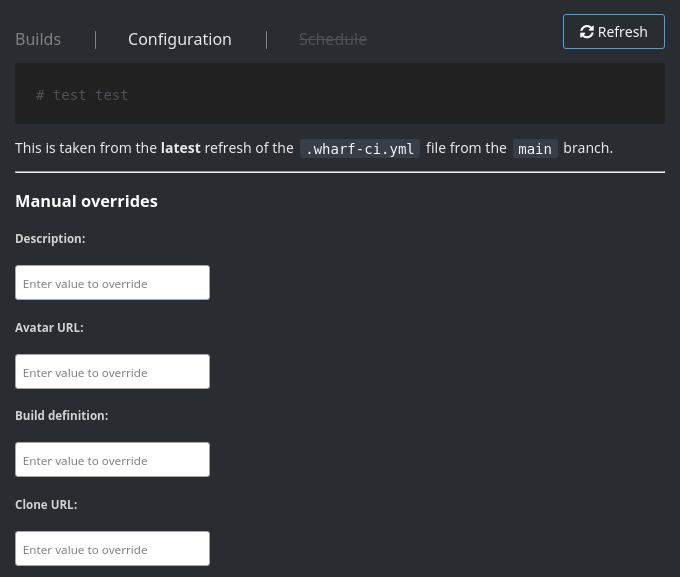

# {{page.title}}

- RFC PR: [iver-wharf/rfcs#{{page.pr_id}}](https://github.com/iver-wharf/rfcs/pull/{{page.pr_id}})
- Feature name: `{{page.rfc_feature_name}}`
- Author: {{page.rfc_author_name}} ([@{{page.rfc_author_username}}](https://github.com/{{page.rfc_author_username}}))
- Implementation issue: [{{page.impl_issue_repo}}#{{page.impl_issue_id}}](https://github.com/{{page.impl_issue_repo}}/issues/{{page.impl_issue_id}})
- Implementation status: 

## Summary

Addition of new table `project_override` which defines almost all of the
columns in the `project` table that, if set, will be used in HTTP response body
and left untouched by HTTP PUT requests.

This is a proposed approach in resolving the issue
[iver-wharf/wharf-provider-gitlab#16](https://github.com/iver-wharf/wharf-provider-gitlab/issues/16),
and while that issue only regards the GitLab provider, this RFC proposes a
solution that is provider-agnostic.

## Motivation

Let users be able to override a project's configuration on a per-project basis,
whilst making sure that provider APIs will not tamper with these values.

Instead of embedding a range of new fields inside the `project` model, we are
creating a whole new table to separate the concern more. This leads to less
bloat in the `database.Project` model, but involves a bit more code to make
sure the `database.ProjectOverrides` is always loaded correctly together with
the `database.Project` model.

## Explanation

### Model changes

The project model inside the `/pkg/model/database` package has this new field
`Overrides` which is a one-to-one relation, where the `Project` model specifies
a [has one association](https://gorm.io/docs/has_one.html) towards the
`ProjectOverrides` model.

```go
// /pkg/model/database
package database

type Project struct {
    ProjectID       uint      `gorm:"primaryKey"`
    Name            string    `gorm:"size:500;not null"`
    // ...snip other existing fields

    // New field:
    Overrides ProjectOverrides `gorm:"foreignKey:ProjectID;constraint:OnUpdate:CASCADE,OnDelete:CASCADE"`
}

// New type:
type ProjectOverrides struct {
    ProjectOverridesID uint   `gorm:"primaryKey"`
    ProjectID          uint   `gorm:"index:project_override_idx_project_id"`
    Description        string `gorm:"size:500;not null;default:''"`
    AvatarURL          string `gorm:"size:500;not null;default:''"`
    BuildDefinition    string `gorm:"not null;default:''"`
    GitURL             string `gorm:"not null;default:''"`
}
```

With GORM's default naming convention conversion that we are using, the
`ProjectOverrides` model will resolve to the table name `project_override`.

### Code changes

Because of this new association, whenever a project is loaded from the database
then yet another association is added to the pre-loading chain inside
`project.go`:

```go
func databaseProjectPreloaded(db *gorm.DB) *gorm.DB {
    return db.Set("gorm:auto_preload", false).
        Preload(database.ProjectFields.Provider).
        Preload(database.ProjectFields.Branches, func(db *gorm.DB) *gorm.DB {
            return db.Order(database.BranchColumns.BranchID)
        }).
        Preload(database.ProjectFields.Token).
        // New preload:
        Preload(database.ProjectFields.Overrides)
}
```

The following code paths are updated to make use of these overrides:

- `main.getDBJobParams` inside `project.go`, which generates the arguments sent
  to the execution engine (Jenkins).

- `modelconv.DBProjectToResponse` inside `/pkg/modelconv/projectconv.go`, which
  creates the `response.Project` that is returned in all project related
  endpoints, such as `GET /projects` and `GET /project/{projectId}`.

These overrides will be applied if their value in the `ProjectOverrides` model
is ["non-zero"](https://golang.org/ref/spec#The_zero_value) on a per-field
basis.

Sample implementation:

```go
func DBProjectToResponse(dbProject database.Project) response.Project {
    return response.Project{
        // ...snip other existing fields

        Description:     fallbackString(dbProject.Overrides.Description, dbProject.Description),
        AvatarURL:       fallbackString(dbProject.Overrides.AvatarURL, dbProject.AvatarURL),
        BuildDefinition: fallbackString(dbProject.Overrides.BuildDefinition, dbProject.BuildDefinition),
        GitURL:          fallbackString(dbProject.Overrides.GitURL, dbProject.GitURL),
    }
}

func fallbackString(value string, ifEmpty string) string {
    if value == "" {
        return ifEmpty
    }
    return value
}
```

### Endpoint changes

No changes to the existing models is done. The mutating endpoints
`POST /project` and `PUT /project` will still only update the `project`
database table and leave the `project_override` table intact.

Endpoints regarding project overrides:

```http
GET /project/{projectId}/override
PUT /project/{projectId}/override
DELETE /project/{projectId}/override
```

#### `GET /project/{projectId}/override`

ID: `getProjectOverrides`\
Get the overrides for a given project.

No HTTP request body.

HTTP response body:

```json
{
  "projectId": 123,
  "description": "",
  "avatarUrl": "",
  "buildDefinition": "",
  "gitUrl": ""
}
```

#### `PUT /project/{projectId}/override`

ID: `updateProjectOverrides`\
Updates the overrides with new values.

HTTP request body:

```json
{
  "description": "",
  "avatarUrl": "",
  "buildDefinition": "",
  "gitUrl": ""
}
```

HTTP response body:

```json
{
  "projectId": 123,
  "description": "",
  "avatarUrl": "",
  "buildDefinition": "",
  "gitUrl": ""
}
```

#### `DELETE /project/{projectId}/override`

ID: `deleteProjectOverrides`\
Deletes all overrides for a given project. Effectively reverting to using the
actual project data.

No HTTP request body.

No HTTP response body.

### Frontend changes

Updating these values via the REST API itself is possible, but user-unfriendly.

Therefore, wharf-web is updated to be able to set these values in the
"Configuration" tab for a project.

Proof of concept configuration fields:



The project description and build definition overrides will need bigger text
field editors to allow multiline edits, and preferably syntax highlighting for
the project build definition editor.

## Compatibility

- The import procedure in the current wharf-provider-... implementations will
  be unaffected by this. From their perspective, they are still updating the
  underlying `project` model, while new builds started from the project will
  use the override values instead of the ones imported by the wharf-provider-...

- Additional issue with embedding the override fields into the project
  model, except the ones mentioned in the [#Motivation](#motivation) section,
  is that we do not want outdated REST clients to reset our overwritten fields.

  Example:

  1. We're in v1 (for the sake of argument).

  2. For v2, we add a field to the `Project` model, named `Project.NewField`.

  3. We expose this in `GET /project` and allow it to be set in `PUT /project`.

  4. A client that supports v1 does a `GET /project` followed by a
     `PUT /project` to update a single field, for example `Project.GitURL`.

  5. The client omits the `Project.NewField` when it serializes the request
     payload to JSON, as it does not think that field exists.

  6. The wharf-api (v2) receives the payload with the missing `Project.NewField`
     and assumes it to be the zero-value for that field's type.

  7. The wharf-api (v2) makes a `UPDATE` SQL query where it sets
     `Project.NewField` to its zero-value (e.g. empty string).

  To fix this, the best solution is to version the wharf-api's endpoints via
  the URL path (ex: `PUT /api/v1/project`), a query parameter
  (ex: `?apiVersion=v1`), or via a header
  (ex: `Content-Type: application/vnd.iver-wharf.project.v1+json`).

  This issue needs to be tackled for future additions to the `Project` model,
  but was evaded with this approach of using a separate model altogether.

## Alternative solutions

- Embedding the fields into the `project` table and models. But as discussed
  already in this RFC, this was not done due to backward compatibility.

- Using a templating syntax to override the `Project.GitURL` for an entire
  provider. Such as defining that the Git SSH URL should be calculated by the
  Go template `ssh://git@gitlab-address-with-ssh-access:2222/{ .path_with_namespace }.git`,
  where `{ .path_with_namespace }` is evaluated from the JSON response that the
  GitLab API responds with when importing the project.

  This would also solve [iver-wharf/wharf-provider-gitlab#16](https://github.com/iver-wharf/wharf-provider-gitlab/issues/16),
  and this template could be set on a per-provider row in the database.

  While this solves the issue in a more generic fashion, it was dismissed
  because it relies on templating and assumed formats. Setting the Git SSH URL
  on a per-project basis instead of on a per-provider basis is more tedious,
  but allows for more fine-grained control. Adding new projects is not
  estimated to be done on such a frequent basis that an overly generic solution
  is needed.

- Apply the overrides in the database directly via custom SQL queries instead
  of inside the Go code.

  GORM does not allow such fine-grained control in any type-safe way. We would
  have to write custom SQL queries, which is discouraged, and therefore
  dismissed.

## Future possibilities

Nothing comes to mind.

## Unresolved questions

Nothing comes to mind.
