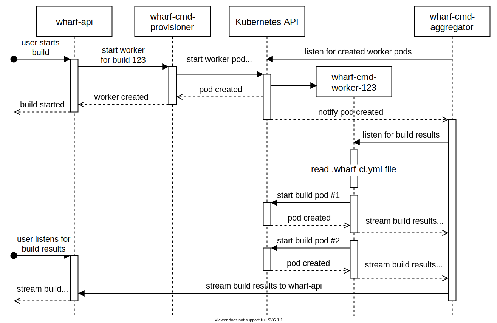

# {{page.title}}

- RFC PR: [iver-wharf/rfcs#{{page.pr_id}}](https://github.com/iver-wharf/rfcs/pull/{{page.pr_id}})
- Feature name: `{{page.rfc_feature_name}}`
- Author: {{page.rfc_author_name}} ([@{{page.rfc_author_username}}](https://github.com/{{page.rfc_author_username}}))
- Implementation issue: [{{page.impl_issue_repo}}#{{page.impl_issue_id}}](https://github.com/{{page.impl_issue_repo}}/issues/{{page.impl_issue_id}})
- Implementation status: 

## Summary

Our previous solution was oriented around Jenkins. This has been proven unstable
and difficult for various reasons, such as deployment of Wharf and Jenkins
together in Kubernetes, debugging capabilities, ability to execute
`.wharf-ci.yml` builds locally, and relaying build logs and artifacts to the
wharf-api and ultimately end-user, etc. This RFC describes our replacement of
Jenkins with four new Wharf components.

There is a heavy focus on making the wharf-cmd-worker subcommand perform
Wharf builds standalone, without a wharf-api and wharf-web to present the
results.

## Motivation

### Human-usable CLI

The goal is that Wharf should be able to be run locally. This means that it
should not have a strong dependency on wharf-api or any other Wharf component,
but instead just to run a build.

The only dependencies for running Wharf on a locally cloned repository should
be to have a [kubeconfig](https://kubernetes.io/docs/concepts/configuration/organize-cluster-access-kubeconfig/)
and executing `wharf run`

### Splitting up wharf-cmd

The previous solution assumed the wharf-cmd component would be responsible for
following tasks:

- Provisioning: From a webhook trigger, provision new versions of itself to
  run the new build in.

  - Create Kubernetes pods with itself
  - Ensure repository containing .wharf-ci.yml is cloned (`git clone`)

- Building: Execute Wharf build according to .wharf-ci.yml.

  - Create Kubernetes pod for each Wharf build step
  - Read logs from pod
  - Pull artifacts from pod

- Reporting: Talk to wharf-api

  - Send build status updates
  - Send logs
  - Send artifacts

This architecture, as similar to the Jenkins which we are trying to emulate it
may be, has some major issues:

- Too much responsibility for a single component. Contains way too many reasons
  to change.

- Hard dependency on the wharf-api. We're instead focusing on a "local first"
  procedure, and having it be started by wharf-api as an add-on, instead of the
  other way around where we would have to lock it down to be able to run
  locally without a wharf-api to talk to.

- Circular dependency: wharf-api depends on wharf-cmd when starting builds, and
  wharf-cmd depends on wharf-api when reporting build status and logs. This
  violates the ["Acyclic-Dependencies Principle (ADP)"](https://agileinaflash.blogspot.com/2009/04/principles-of-package-coupling.html).

- Bidirectional network access: Running builds in a different environment than
  where you're hosting apps such as the wharf-api and wharf-web to distribute
  the workload and not accidentally throttle your services with builds. While
  the design makes it possible, it does require network access in both
  directions from the "hosting" environment back to the "building" environment.

- No way to detect when a build went "missing"; where wharf-api thinks a build
  was started but status update was sent that it crashed or was removed from
  Kubernetes, and so it's perpetually in "Scheduling" or "Running" status.
  This is misleading the user to thinking that Wharf is still trying to start
  the build while the truth is that wharf-api does nothing about it.

For these reasons, we are transitioning over to a master-worker architecture
and separating some of these concerns into different components, all prefixed
with `wharf-cmd-`.

## Explanation

The `wharf-cmd` repository (<https://github.com/iver-wharf/wharf-cmd>) is split
up into four main subcommands:

| Component             | Command                       |
| ---------             | ----------                    |
| wharf-cmd-worker      | `wharf run ...`               |
| wharf-cmd-provisioner | `wharf provisioner serve ...` |
| wharf-cmd-aggregator  | `wharf aggregator serve ...`  |
| wharf-cmd-watchdog    | `wharf watchdog serve ...`    |

### Diagrams


In the above diagram, components colored green are new components proposed in
this RFC. The arrows signify the direction of communication and dependency.

> For history and perspective, here's our previous architectural design, with
> components proposed to be replaced colored red:
> 
> <details><summary>Diagram of previous design (click to expand)</summary>
> 
> </details>

All communication is initiated by the end-user who can only talk to the
wharf-api, and the flow looks like so:



Whereas if the wharf-cmd-worker is executed locally, all but the Kubernetes API
and the wharf-cmd-worker itself are involved:


### Terminology

- **wharf-cmd-worker**: Component that reads the .wharf-ci.yml file and starts
  up Kubernetes pods or Docker containers to run the individual Wharf build
  steps. Sometimes referred to as "Wharf worker" or simply "worker".

- **wharf-cmd-provisioner**: Component that spins up Kubernetes pods or Docker
  containers that contains wharf-cmd-worker. Used by wharf-api as an
  abstraction so wharf-api does not need to know about the execution platform.
  Sometimes referred to as "Wharf provisioner" or simply "provisioner".

- **wharf-cmd-aggregator**: Component that connects to wharf-cmd-workers and
  wharf-api to feed build results from the workers over to the wharf-api.
  Sometimes referred to as "Wharf aggregator" or simply "aggregator".

- **wharf-cmd-watchdog**: Component that connects to wharf-cmd-provisioner and
  wharf-api to see if any builds that wharf-api thinks still exists no longer
  exists, and tells wharf-api about it.

- **build**: An execution based on the definition from a `.wharf-ci.yml` file.
  It does not require binaries to be built, but the term "build" is used for
  consistency.

- **build step pod**: A Kubernetes pod started by wharf-cmd-worker to execute
  a Wharf build step.

- **build step container**: A Docker container started by wharf-cmd-worker to
  execute a Wharf build step, usually (but not strictly) referring to when
  targeting Docker instead of Kubernetes.

- **build results**: Logs, artifacts, and status updates, created by the Wharf
  builds and exposed by the wharf-cmd-worker. Sometimes referred to as simply
  "results".

- **hosting environment**: The environment, such as a Kubernetes cluster, where
  the static Wharf components are hosted. This being all components except
  wharf-cmd-worker and their build step pods.

- **build environment**: The environment, such as a Kubernetes cluster, where
  builds are performed by wharf-cmd-worker instance. This may or may not be the
  same cluster and even namespace as the other Wharf components (by mixing
  hosting and build environments), a decision left up to the system
  administrator who is installing Wharf.

### Component: wharf-cmd-worker

- Go package path: `github.com/iver-wharf/wharf-cmd/pkg/cmd/run`
- Subcommand: `wharf run ...`

The work-horse of the wharf-cmd repository. Can be invoked as a standalone from
an end-user's local computer where only the build is performed and no wharf-api
or database is needed, or the wharf-cmd-worker be spawned by
wharf-cmd-provisioner when triggered via the wharf-api in a full deployment of
all Wharf's components in a Kubernetes cluster to gain the benefits of a web
interface and cloud-hosted persistent storage of build history.
See the comparison of the sequence diagrams in the [#Diagrams](#diagrams)
section above.

The wharf-cmd-worker is short-lived. An instance is created for a specific
Wharf build, and is terminated once the build is complete.

#### wharf-cmd-worker responsibilities

- Interpret `.wharf-ci.yml` file from already cloned repository.

- Start up pods (Kubernetes) or containers (Docker) to execute the steps defined
  in the `.wharf-ci.yml` file, using credentials from either `~/.kube/config`
  or the [in-cluster](https://pkg.go.dev/k8s.io/client-go/rest#InClusterConfig)
  configuration.

- Cache build results on its local disk storage.

- Provide gRPC and HTTP/REST APIs to read cached build results.

- Transfer repository containing `.wharf-ci.yml` into build pods.

#### wharf-cmd-worker HTTP server

Exposes HTTP server that listens for:

- `GET /api/build/step` lists steps with their status, parent ID, and IDs
- `GET /api/artifact` lists artifacts
- `GET /api/artifact/:artifactId/download` downloads an artifact

#### wharf-cmd-worker gRPC server

Exposes gRPC server with service:

```proto
syntax = "proto3";
import "google/protobuf/timestamp.proto";

// Versioning via package name, for future-proofing
package wharf.worker.v1;

option go_package = "github.com/iver-wharf/wharf-cmd/pkg/proto/worker/v1";

service Worker {
  rpc Logs(LogsRequest) returns (stream LogsResponse);
  rpc StatusEvents(StatusEventsRequest) returns (stream StatusEventsResponse);
  rpc ArtifactEvent(ArtifactEventRequest) returns (stream ArtifactEventResponse);
}

// Empty messages, but exists for potential future usages
message LogRequest { }
message StatusEventsRequest { }
message ArtifactEventRequest { }

message LogResponse {
  int64 log_id = 1; // not DB value; worker's own ID of the log line
  int32 step_id = 2; // not DB value; worker's own ID of the step ID
  google.protobuf.Timestamp timestamp = 3;
  string line = 4;
}

message StatusEventsResponse {
  int32 event_id = 1; // not DB value; worker's own ID of the event
  int32 step_id = 2; // not DB value; worker's own ID of the step ID

  enum Status {
    SCHEDULING = 0;
    RUNNING = 1;
    FAILED = 2;
    COMPLETED = 3;
  }
  Status status = 3;
}

message ArtifactEventResponse {
  int32 artifact_id = 1; // not DB value; worker's own ID of the artifact
  int32 step_id = 2; // not DB value; worker's own ID of the step ID
  string name = 3;
}
```

#### wharf-cmd-worker build results storage

Events storage refers to the build results outputted from the wharf-cmd-worker's
child pods/containers. This needs to be cached inside the wharf-cmd-worker
itself.

- **Why?** To allow wharf-cmd-aggregator to sync the events when it can,
  instead of only when it arrives at the wharf-cmd-worker. This to not have
  data go lost just because wharf-cmd-aggregator crashed or was upgraded.

- **When?** As data comes out from the wharf-cmd-worker's child pods/containers.
  No polling should be made. All logs and events are to be streamed
  asynchronously by Kubernetes's and Docker's "event watch"/"logs follow"
  functionality.

- **Where?** Just inside the container's own storage. Not necessary to cache via
  Kubernetes Persistent Volumes or Docker volumes. The wharf-cmd-worker
  component will not be restarted when upgraded, and we do not tackle restoring
  state from a wharf-cmd-worker crash in this RFC.

  - Variables:

    - `{buildId}`: build ID provided to (or generated by) wharf-cmd-worker
    - `{stepId}`: integer step ID generated by wharf-cmd-worker
    - `{artifactId}`: integer artifact ID generated by wharf-cmd-worker
    - `{artifactFileName}`: string file name 
    - `{resultsDir}`: string path, defaults to `/tmp/iver-wharf/build/{buildId}`

  - Paths:

    - Logs: `{resultsDir}/steps/{stepId}/output.log`
    - Build status updates: `{resultsDir}/steps/{stepId}/status.json`
    - Artifact metadata: `{resultsDir}/steps/{stepId}/artifacts.json`
    - Artifact BLOBs: `{resultsDir}/steps/{stepId}/artifacts/{artifactId}-{artifactFileName}`

- **How?**

  - **Logs** will be streamed directly to file. One log message per line,
    prefixed with the RFC-3339 (with nanoseconds) formatted time
    ([`time.RFC3339Nano`](https://pkg.go.dev/time#pkg-constants)) and a space,
    where the line index will be the wharf-cmd-worker's internal log event ID.

    - Kubernetes: Use API equivalent to `kubectl logs ${podName} --timestamps`
    - Docker: Use API equivalent to `docker logs ${containerName} --timestamps`

    This time format is carefully chosen as both Kubernetes and Docker outputs
    this format when provided with the `--timestamps` flag. Meaning the
    streaming of logs can be piped directly to a file by wharf-cmd-worker for
    super-fast storing of logs.

    Example log file `{resultsDir}/steps/{stepId}.log`:

    ```text
    2021-11-24T11:22:00.000Z [2021-11-24 11:22] Restoring packages for "myProject"...
    2021-11-24T11:22:03.200Z  Done in 3.2s.
    2021-11-24T11:22:03.800Z [2021-11-24 11:22] Compiling "myProject"...
    2021-11-24T11:22:08.800Z  Done in 5s.
    ```

  - **Build status** update events will be stored as a single JSON object.

    - Kubernetes: Use API equivalent to running
      `kubectl get pod ${podName} --watch` or `kubectl get events --watch`

    - Docker: Use API equivalent to polling
      `docker container inspect ${containerName}`

    Example build status updates file `{resultsDir}/steps/{stepId}/status.json`:

    ```json
    {
      "statusUpdates": [
        { "statusId": 1, "timestamp": "2021-11-24T11:22:00.000Z", "statusId": 0},
        { "statusId": 2, "timestamp": "2021-11-24T11:22:03.200Z", "statusId": 1},
        { "statusId": 4, "timestamp": "2021-11-24T11:22:08.800Z", "statusId": 3}
      ]
    }
    ```

  - **Artifacts** will be stored as files at
    `{resultsDir}/steps/{stepId}/artifacts/{artifactId}_{artifactFileName}`.
    Metadata about the artifacts will be stored as a single JSON object at
    `{resultsDir}/steps/{stepId}/artifacts.json`.

    - Kubernetes: Set up a sidecar with a shared `emptyDir`. When main job has
      finished then use API equivalent to `kubectl cp` from the sidecar.

    - Docker: Use API equivalent to `docker cp`, which can be done on
      terminated containers.

    Example artifacts metadata file
    `{resultsDir}/steps/{stepId}/artifacts.json`:

    ```json
    {
      "artifacts": [
        { "artifactId": 1, "name": "myArtifact.png", "path": "artifacts/1_myArtifact.png" }
      ]
    }
    ```

    The `"name"` is the actual name used when provided via the
    wharf-cmd-worker's HTTP and gRPC APIs. The `"path"` is the path of where
    the BLOB is cached, relative to the `artifacts.json` file. This distinction
    is needed to preserve the file name when running wharf-cmd-worker on
    a Windows machine, as [Windows has much more strict rules for file names](https://docs.microsoft.com/en-us/windows/win32/fileio/naming-a-file#naming-conventions)
    compared to GNU/Linux and Mac OS X and would therefore need some
    escaping/normalization when caching on a Windows machine.

#### wharf-cmd-worker transferal of repository

- Docker:

  1. Copy the repository to a temporary location, such as
     `/tmp/iver-wharf/wharf-cmd/build/{buildId}/{stepId}/repo`, including
     hidden directories and files such as the `.git` directory.

  2. Mount the directory as a volume into the to-be-created container.

  3. When execution is done, remove the temporary repository clone.

- Kubernetes:

  1. Create pod with an init container named `init-repo` to the pod that sits
     and waits and an `emptyDir` volume mapped to both the init container and
     the regular container for this build step, mounted at `/mnt/repo`.
 
  2. Perform `kubectl cp {repoRoot} {podName}:/mnt/repo --container "init-repo"`
     (or equivalent).
 
  3. Tell the init container to complete. Execution of regular container can
     start.

This means that a "dirty" Git repository (with changed or untracked files) will
be copied as-is. It also means that any `.gitignore`'d files will also be
copied over, so performance when running locally towards a Kubernetes cluster
may degrade significantly on slower networks as the repository needs to be
transferred multiple times, once per Wharf build step.

#### wharf-cmd-worker Kubernetes ownerReferences

While wharf-cmd-worker is responsible for cleaning up after itself, it can use
Kubernetes to aid it in case of unexpected crashes.

The Kubernetes `metadata.ownerReferences` key is assigned by wharf-cmd-worker
in its Wharf build step pods, with values pointing to the wharf-cmd-worker pod
that started the job.

Example:

```yaml
apiVersion: v1
kind: Pod
metadata:
  name: wharf-cmd-worker-bc314agers-brs13a
  labels:
    wharf.iver.com/buildRef: 123
    wharf.iver.com/stage: myStage
    wharf.iver.com/step: myStep

  ## Important part:
  ownerReferences:
    - apiVersion: v1
      kind: Pod
      name: wharf-cmd-worker-bc314agers
      uid: a1211487-9a07-4b87-a577-e9624d08f783
      blockOwnerDeletion: true
      controller: true

spec:
  containers:
  - name: container
    image: ubuntu:latest
```

This will effectively make it so if the owner, `wharf-cmd-worker-bc314agers`,
is terminated then the child pods will automatically be deleted as well.

> Note: This is only possible if the wharf-cmd-worker is hosted in the
> Kubernetes cluster as well, in the same namespace as the Wharf build step
> pods. Therefore, this is an optional feature that's only applied in certain
> flows, such as when starting a job via the wharf-cmd-provisioner.

For this to be possible, wharf-cmd-worker needs to know its own
[name](https://kubernetes.io/docs/concepts/overview/working-with-objects/names/#names)
and [UID](https://kubernetes.io/docs/concepts/overview/working-with-objects/names/#uids).
This is accomplished via environment variables:

```yaml
apiVersion: v1
kind: Pod
metadata:
  name: wharf-cmd-worker-bc314agers
spec:
  containers:
    - name: wharf-cmd-worker
      env:
        - name: WHARF_KUBERNETES_OWNER_ENABLE
          value: "true"
        - name: WHARF_KUBERNETES_OWNER_NAME
          valueFrom:
            fieldRef:
              apiVersion: v1
              fieldPath: metadata.name
        - name: WHARF_KUBERNETES_OWNER_UID
          valueFrom:
            fieldRef:
              apiVersion: v1
              fieldPath: metadata.uid
```

These environment variable mappings has to be set up by the
wharf-cmd-provisioner, but the wharf-cmd-worker has to support them and take
advantage of them when creating its child pods.

### Component: wharf-cmd-provisioner

- Go package path: `github.com/iver-wharf/wharf-cmd/pkg/cmd/provisioner`
- Subcommand: `wharf provisioner serve ...`

#### wharf-cmd-provisioner responsibilities

- REST/HTTP API endpoint to start up (create) pods containing:

  - service account with permission to create new pods in the same namespace.
  - init container that clones the repository on the correct commit or branch.
  - work container with wharf-cmd-worker to operate on the cloned repository.

- REST/HTTP API endpoint to list and delete existing pods.

#### wharf-cmd-provisioner HTTP server

Exposes HTTP server that listens for:

- `GET /api/worker`, called by wharf-cmd-watchdog to evaluate which builds
  have missing workers.

- `POST /api/worker`, called by wharf-api to start build, thereby starting
  wharf-cmd-worker pods.

- `DELETE /api/worker/:workerId`, called by wharf-api when cancelling a build
  or when a build is marked as done (status = Succeeded or Failed), or by
  wharf-cmd-watchdog when it has issued removal of a worker that doesn't exist
  in the wharf-api.

### Component: wharf-cmd-aggregator

- Go package path: `github.com/iver-wharf/wharf-cmd/pkg/cmd/aggregator`
- Subcommand: `wharf aggregator serve ...`

#### wharf-cmd-aggregator responsibilities

- Watch the Kubernetes building environment / namespace for new
  wharf-cmd-worker pods and connect to them.

- For each wharf-cmd-worker, via their gRPC and HTTP APIs, listen for build
  results and forward them to the wharf-api.

#### wharf-cmd-aggregator connecting to wharf-cmd-worker

The wharf-cmd-aggregator is provided with Kubernetes credentials to access the
same building environment as the wharf-cmd-provisioner targets.

As this "build environment" could live in a separate Kubernetes cluster, we
cannot rely on Kubernetes' internal DNS and network.

Instead, [port-forwarding](https://pkg.go.dev/k8s.io/client-go@v0.23.0/tools/portforward)
will be used to connect randomly selected ports on the wharf-cmd-aggregator
over to the published ports on the wharf-cmd-worker for gRPC and HTTP/REST
traffic.

> With the limit of 65k ports by the OS, an instance of wharf-cmd-aggregator
> has an upper limit of connecting to approximately 32k wharf-cmd-worker
> instances.
>
> This limit can be avoided by increasing the number of wharf-cmd-aggregator
> replicas to share the load, but it's estimated that the network throughput
> will be a limiting factor long before wharf-cmd-aggregator reaches this
> theoretical upper limit.

#### wharf-cmd-aggregator scaling

For larger deployments of Wharf with large amount of wharf-cmd-workers active
at the same time, the wharf-cmd-aggregator can be scaled up to spread the load
of feeding data from the wharf-cmd-workers to the wharf-api.

Each wharf-cmd-aggregator instance is deployed with a distinct integer filtering
value, ranging from `1` to `N`, where `N` is the number of
wharf-cmd-aggregator replicas.

> For Kubernetes-hosted Wharf, the wharf-cmd-aggregator is deployed as an
> StatefulSet where this filtering index is the ["Ordinal Index"](https://kubernetes.io/docs/concepts/workloads/controllers/statefulset/#ordinal-index)
> for each given instance, plus 1.

The wharf-cmd-aggregator watches the build environment for new pods and
filters out the result based on a modulo operation where the filtering value
is the right-hand operand, and some uniquely identifiable integer is the
left-hand operand.

> For Kubernetes-hosted Wharf, the left-hand operand is the wharf-cmd-worker
> pod's UID (`.metadata.uid`) converted to an integer.

The result of this is that, given that all of the wharf-cmd-aggregator are up
and ready, no two instances will connect to the same wharf-cmd-worker.

For example, given there are 3 replicas:

| wharf-cmd-worker   | wharf-cmd-aggregator   |
| ------------------ | ---------------------- |
| wharf-cmd-worker-0 | wharf-cmd-aggregator-0 |
| wharf-cmd-worker-1 | wharf-cmd-aggregator-1 |
| wharf-cmd-worker-2 | wharf-cmd-aggregator-2 |
| wharf-cmd-worker-3 | wharf-cmd-aggregator-0 |
| wharf-cmd-worker-4 | wharf-cmd-aggregator-1 |
| wharf-cmd-worker-5 | wharf-cmd-aggregator-2 |

### Component: wharf-cmd-watchdog

- Go package path: `github.com/iver-wharf/wharf-cmd/pkg/cmd/watchdog`
- Subcommand: `wharf watchdog serve ...`

Name is a direct reference to a [watchdog timer](https://en.wikipedia.org/wiki/Watchdog_timer);
a computer chip which's entire job is to watch for corrupt states.

#### wharf-cmd-watchdog responsibilities

- The wharf-cmd-watchdog component only talks to the wharf-api and the
  wharf-cmd-provisioner. 

- Find "missing" and "stray" builds by performing differentials on the list of
  builds from wharf-api and the list of wharf-cmd-worker's from
  wharf-cmd-provisioner, and invoke updates to both when they are out of sync.

#### wharf-cmd-watchdog procedure

On an interval of 5 minutes (configurable), wharf-cmd-watchdog will:

1. Get list of workers from wharf-cmd-provisioner.

2. Get the list of active builds from the wharf-api (where build status is none
   of: Failed, Succeeded)

3. Calculate differentials and report inconsistencies:

   - For any build in wharf-cmd-provisioner's results, but not in wharf-api's
     results, and worker has lived longer than 1 minute (configurable), tell
     wharf-cmd-provisioner to cancel those builds.

   - For any build in wharf-api's results but not in wharf-cmd-provisioner's
     results, and build is older than 1 minute (configurable), tell wharf-api
     to update the build's status to "Failed".

If any of the above tasks fails, then wharf-cmd-watchdog will log a warning and
retry first on the next planned iteration cycle. The added worker/build lifetime
check is to get around any potential race-conditions.

### Component: wharf-api

#### wharf-api responsibilities

- Stay as a CRUD (Create, Read, Update, Delete) store, and the source of truth.

- When creating a new build in the database, also tell wharf-cmd-provisioner to
  create a new wharf-cmd-worker instance for that build.

#### wharf-api changes

Changes are made to the existing wharf-api:

- `response.Build` and `database.Build` gets a new "worker ID" string field
  (see [#Concept: Worker ID](#concept-worker-id), which is automatically
  assigned by wharf-api after calling wharf-cmd-provisioner's `POST /api/worker`
  endpoint.

  ```diff
  @@ pkg/model/database/database.go @@
   type Build struct {
       TimeMetadata
       BuildID             uint                `gorm:"primaryKey"`
       StatusID            BuildStatus         `gorm:"not null"`
       ProjectID           uint                `gorm:"not null;index:build_idx_project_id"`
       Project             *Project            `gorm:"foreignKey:ProjectID;constraint:OnUpdate:CASCADE,OnDelete:CASCADE"`
       ScheduledOn         null.Time           `gorm:"nullable;default:NULL"`
       StartedOn           null.Time           `gorm:"nullable;default:NULL"`
       CompletedOn         null.Time           `gorm:"nullable;default:NULL"`
       GitBranch           string              `gorm:"size:300;not null;default:''"`
       Environment         null.String         `gorm:"nullable;size:40" swaggertype:"string"`
       Stage               string              `gorm:"size:40;not null;default:''"`
  +    WorkerID            string              `gorm:"not null;default:''"`
       Params              []BuildParam        `gorm:"foreignKey:BuildID;constraint:OnUpdate:CASCADE,OnDelete:CASCADE"`
       IsInvalid           bool                `gorm:"not null;default:false"`
       TestResultSummaries []TestResultSummary `gorm:"foreignKey:BuildID"`
   }
  ```

  ```diff
  @@ pkg/model/response/response.go @@
   type Build struct {
       TimeMetadata
       BuildID               uint                  `json:"buildId" minimum:"0"`
       StatusID              int                   `json:"statusId" enums:"0,1,2,3"`
       Status                BuildStatus           `json:"status" enums:"Scheduling,Running,Completed,Failed"`
       ProjectID             uint                  `json:"projectId" minimum:"0"`
       ScheduledOn           null.Time             `json:"scheduledOn" format:"date-time" extensions:"x-nullable"`
       StartedOn             null.Time             `json:"startedOn" format:"date-time" extensions:"x-nullable"`
       CompletedOn           null.Time             `json:"finishedOn" format:"date-time" extensions:"x-nullable"`
       GitBranch             string                `json:"gitBranch"`
       Environment           null.String           `json:"environment" swaggertype:"string" extensions:"x-nullable"`
       Stage                 string                `json:"stage"`
  +    WorkerID              string                `json:"workerId"`
       Params                []BuildParam          `json:"params"`
       IsInvalid             bool                  `json:"isInvalid"`
       TestResultSummaries   []TestResultSummary   `json:"testResultSummaries"`
       TestResultListSummary TestResultListSummary `json:"testResultListSummary"`
   }
  ```

- `database.Log` gets new fields:

  > Note the `index` tags on the `WorkerLogID` and `WorkerStepID` fields. This
  > is because these fields will be heavily queried during ingestion.

  ```diff
  @@ pkg/model/database/database.go @@
   type Log struct {
       LogID        uint      `gorm:"primaryKey"`
  +    WorkerLogID  uint      `gorm:"not null;default:0;index:log_idx_worker_log_id"`
  +    WorkerStepID uint      `gorm:"not null;default:0;index:log_idx_worker_step_id"`
       BuildID      uint      `gorm:"not null;index:log_idx_build_id"`
       Build        *Build    `gorm:"foreignKey:BuildID;constraint:OnUpdate:CASCADE,OnDelete:CASCADE"`
       Message      string    `sql:"type:text"`
       Timestamp    time.Time `gorm:"not null"`
   }
  ```

- The `response.Log` struct is left unchanged.

### Concept: Worker ID

The worker ID is a string that uniquely identifies a worker for a given
wharf-cmd-provisioner. The content of the ID does only need to make sense to
the wharf-cmd-provisioner, as it's used when listing and deleting existing
wharf-cmd-worker instances.

- For Kubernetes this is the pod's name.
- For Docker this is the container's ID (which is a hex-formatted SHA256 sum).

### Concept: log_id, step_id, event_id, and artifact_id

The responses from wharf-cmd-worker's APIs contains a lot of ID fields.
As noted by the comments, these are not values from Wharf's database but instead
values assigned and tracked by the wharf-cmd-worker.

These values needs to be stored in the database to allow the
wharf-cmd-aggregator to make idempotent insertions into the database.
With this, if the wharf-cmd-aggregator restarts in the middle of streaming,
it can still recover where it left off without causing duplicated data inside
the database.

Sample insertions logic in wharf-api:

```go
// @router /build/{buildId}/log [put]
func (m buildModule) createLog(c *gin.Context) {
  var reqLog request.Log
  c.ShouldBindJSON(reqLog)
  buildID, _ := ginutil.ParseParamUint(c, "buildId")

  var dbLog = database.Log{
    BuildID:      buildId,
    WorkerStepID: reqLog.WorkerStepID,
    WorkerLogID:  reqLog.WorkerLogID,
    Message:      reqLog.Message,
  }

  db.Where(database.Log{
    BuildID:      buildId,
    WorkerStepID: reqLog.WorkerStepID,
    WorkerLogID:  reqLog.WorkerLogID,
  }).FirstOrCreate(&dbLog)
}
```

### Authentication

No authentication will be performed **in this first iteration** for the
wharf-cmd-worker or wharf-cmd-provisioner. These components are not meant to be
exposed and can therefore rely on the network filtering away all traffic from
any potential end-users.

If authentication is enabled in wharf-api (implementation of
[RFC-0013](./0013-authentication)), then the wharf-cmd-aggregator and
wharf-cmd-watchdog needs logic to authenticate properly.

## Compatibility

The interface for starting builds from wharf-api's perspective is the same as
our previous Jenkins-oriented solution. Meaning switching back to our previous
solution is possible until we deem our new solution (the one proposed in this
RFC) stable enough.

Full compatibility is expected with existing `.wharf-ci.yml` files as wharf-cmd
is designed to be feature-par with the previous implementation.

## Alternative solutions

- Have wharf-api poll data from wharf-cmd-workers instead of the
  wharf-cmd-aggregator. But this means the wharf-api would increase it's
  responsibility from just being a CRUD store.

- Have wharf-cmd-worker talk directly to the wharf-api. This idea was
  disregarded due to the issues mentioned in the [#Motivation](#motivation)
  section above.

- Let the wharf-cmd-worker only serve gRPC instead of also HTTP. But gRPC has
  horrible performance when it comes to large binaries as it has to buffer each
  message as a whole, so we use regular HTTP which can stream files from disk
  to the network for our artifacts transfer.

- Add trailing newline in the message field on a log instead of adding new
  field `"lineEnding"`, such as storing `{"message":"Compiling..."}` instead of
  `{"message":"Compiling...","lineEnding":""}`.

  This however breaks backward compatibility, as logs have so far not been
  stored with trailing newlines in the database for existing builds. Keeping
  backward compatibility is important as we need Jenkins as a fallback solution
  until wharf-cmd is stable enough.

- Use a local database for build results in wharf-cmd-worker, such as Sqlite.
  However, there are some major drawbacks to using Sqlite:

  - [Must compile with CGo](https://github.com/mattn/go-sqlite3#installation)

  - User who runs wharf-cmd-worker locally cannot access results directly, but
    must instead first export them from the Sqlite `.db` file.

  - Cannot stream cell data from Sqlite. So artifacts should still be stored on
    disk to not force artifacts to fit inside the wharf-cmd-worker's RAM just
    for buffering.

- Add init container to each build step pod that wharf-cmd-worker creates,
  instead of having it transfer the repository. Cloning at the beginning of
  each step is how it worked before, but it has its drawbacks:

  - Adds unnecessary requests to the repository host (e.g a self-hosted GitLab
    with bad performance or a bad network connection to said host) when it
    already has the repository cloned.

  - Previous implementation had issue with race conditions, where it started a
    build on the `master` branch, and mid-build `master` was updated, so the
    files were inconsistent throughout the same build.

  - wharf-cmd-worker requires credentials to the repository with the
    `.wharf-ci.yml` file to be able to clone it for each step.

## Future possibilities

- Allow filtering in the wharf-cmd-worker's gRPC API, such as:

  ```proto
  import "google/protobuf/timestamp.proto";
  
  message LogRequest {
    int32 start_id // only logs starting with ID
    int32 step_id // only logs from certain step
    google.protobuf.Timestamp since // only logs since timestamp
    google.protobuf.Timestamp before // only logs before timestamp
  }
  ```

  This could let the wharf-cmd-aggregator to skip all the logs it already knows
  about (in coordination with wharf-api to figure out this `start_id`),
  resulting in faster recovery after a reboot of wharf-cmd-aggregator.

- Kubernetes support will be of main focus to get feature complete first, and
  can later be used in the Docker implementation for reference. While
  this RFC mentions Docker implementation details, it is merely there to plan
  ahead.

- Extracting the Kubernetes and Docker implementations into different plugins
  would be wise to trim down the binary size and make Wharf mode extensible
  without needing the new targets get merged with the upstream repository.

  This proposal does not however restrict us from extracting the functionality
  into a plugin-architecture later.

- Transferal of repository can be heavily optimized from the proposed
  implementation in this RFC. Such as:

  - We can support Persistent Volumes (PV) when wharf-cmd-worker is hosted in
    Kubernetes, where the PV would only need to be set up once and could then
    be mounted into the various pods. However, this needs further investigation
    as not all [Container Storage Interfaces (CSI) provisioners](https://kubernetes.io/docs/concepts/storage/storage-classes/#provisioner)
    support mounting a PV (even in read-only mode) on to multiple Kubernetes
    nodes. Perhaps even streamlining it so the initial clone is made directly
    on to the mounted PV. Need to be careful here though as stray PVCs must
    also be cleaned up properly.

  - We could add logic to tar the repository only once and then reusing the
    same `repo.tar` file in transferal of repo files when targeting Kubernetes
    (both from local machine and from Kubernetes-hosted wharf-cmd-worker).
    Adding in some compression such as [`gzip`](https://www.ietf.org/rfc/rfc1952.txt),
    [`xz`](https://tukaani.org/xz/), or [`brotli`](https://www.ietf.org/rfc/rfc7932.txt)
    could improve performance a lot for builds with numerous build steps.

  - We could add a flag for only transferring the tracked Git files, by doing
    the equivalent to `tar -cf repo.tar .git $(git ls-files)`. This could
    improve performance for NPM or .NET projects a lot as they store the
    dependencies inside the repositories but `.gitignore`'d. Fetching the
    dependencies on each build step inside the cluster could be much better
    performing if the Kubernetes cluster has magnitudes better network.

## Unresolved questions

- Names of components. Please supply additional pros/cons with each suggestion,
  and perhaps come with suggestions of your own. The examples are in no
  particular order.

  > *It's always the exiting time for choosing a component's name. It's an
  > important decision as we'll use this name in verbal and written
  > communication from here on out. Choosing a name that's self-explanatory is
  > key to making Wharf's component easily understood.*

  Below are a bunch of brainstorm ideas.

  - Alternative names for component that runs the .wharf-ci.yml scheme? Ex:

    - wharf-cmd-worker
    - wharf-cmd-runner (matches the subcommand)
    - wharf-cmd-engine
    - wharf-cmd-builder (correlates nicely with `build` from the wharf-api)
    - wharf-cmd-processor
    - ~~wharf-cmd-agent~~ (suggests it sits and waits, instead of on-demand)
    - ~~wharf-cmd-executor~~ (violent)
    - ~~wharf-cmd~~ (ambiguous)

  - Alternative names for component forwards build results to the wharf-api? Ex:

    - wharf-cmd-aggregator
    - wharf-cmd-monitor
    - wharf-cmd-ingest
    - wharf-cmd-reporter
    - ~~wharf-cmd-relay~~ (confusing semantic: who's relaying to who?)
    - ~~wharf-cmd-broker~~ (mostly used in legal and SQL contexts)
    - ~~wharf-cmd-proxy~~ (not proxying anything as nothing is contacting it)
    - ~~wharf-cmd-egress~~ (collides with networking terms)

  - Alternative names for component that starts up the builder pods when
    requested to do so by the wharf-api? Ex:

    - wharf-cmd-provisioner
    - wharf-cmd-scheduler (y: adds builds as Scheduling, n: find existing)
    - wharf-cmd-orchestrator (suggests it manages pods on its own)
    - ~~wharf-cmd-manager~~ (suggests it manages pods on its own)
    - ~~wharf-cmd-ingress~~ (collides with networking terms)
    - ~~wharf-cmd-server~~ (overused in IT to refer to website/game backends)

  - Alternative names for component that watches builder pods to detect
    "missing" builds? Ex:

    - wharf-cmd-watchdog (spot on reference to watchdog computer chips)
    - wharf-cmd-watcher
    - wharf-cmd-monitor
