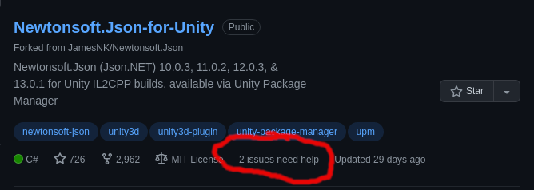

# {{page.title}}

- RFC PR: [iver-wharf/rfcs#{{page.pr_id}}](https://github.com/iver-wharf/rfcs/pull/{{page.pr_id}})
- Feature name: `{{page.rfc_feature_name}}`
- Author: {{page.rfc_author_name}} ([@{{page.rfc_author_username}}](https://github.com/{{page.rfc_author_username}}))
- Implementation issue: [{{page.impl_issue_repo}}#{{page.impl_issue_id}}](https://github.com/{{page.impl_issue_repo}}/issues/{{page.impl_issue_id}})
- Implementation status: 

## Summary

We are currently using mostly "vanilla GitHub" labels. This restricts us in our
way to quickly convey the categories of issues and PRs, as well as our lack of
prioritization makes it really tough to understand what is important.

## Motivation

We lack any form of prioritization in our GitHub issues, as well as more
fine grained labels to categorize our work in other than just `enhancement`.

## Explanation

### Issue/PR prioritization labels

Issues are prioritized via one of four labels, all prefixed with `p/` as an
abbreviation of `priority/`:

| Label    | Description                                          |
| -----    | -----------                                          |
| `p/crit` | Critical priority. "Drop everything to work on this" |
| `p/high` | High priority. "Must have"                           |
| `p/med`  | Medium priority. "Good to have"                      |
| `p/low`  | Low priority. "Nice to have"                         |

### Issue/PR type labels

Issues or PRs has one the following types, which we categorize with one of
eight labels, all prefixed with `t/` as an abbreviation of `type/`:

<!-- lint disable maximum-line-length -->

| Label        | Description                                                    | Former label name |
| -----        | -----------                                                    | ----------------- |
| `t/feature`  | New feature or request                                         | `enhancement`     |
| `t/bug`      | Something isn't working                                        | `bug`             |
| `t/docs`     | Improvements or additions to documentation                     | `documentation`   |
| `t/deps`     | Pull requests that update a dependency file                    | `dependencies`    |
| `t/question` | Further information is requested                               | `question`        |
| `t/release`  | New release for this repo                                      | `release`         |
| `t/chore`    | Refactoring or other changes not affecting end-users           |                   |
| `t/meta`     | Meta-issue: issue that manages other issues                    |                   |
| `t/rfc`      | This issue or pull request contains a new Request For Comments | `rfc`             |

<!-- lint enable maximum-line-length -->

Some of the above are renamed labels from what GitHub provides by default or
labels we at Wharf has added in the past. These previous label names are found
in the "Former label name" column.

The `t/rfc` label only applies to the <https://github.com/iver-wharf/rfcs> repo.

### Issue/PR state labels

These labels explain the state of an issue or PR.

<!-- lint disable maximum-line-length -->

| Label              | Description                               | Former label name |
| -----              | -----------                               | ----------------- |
| `s/dup`            | This issue or pull request already exists | `duplicate`       |
| `good first issue` | Good for newcomers                        | *left as-is*      |
| `help wanted`      | Extra attention is needed                 | *left as-is*      |
| `s/invalid`        | This doesn't seem right                   | `invalid`         |
| `s/wontfix`        | This will not be worked on                | `wontfix`         |
| `s/rfc`            | Based on a Wharf RFC                      |                   |

<!-- lint enable maximum-line-length -->

## Compatibility

Two labels are left as-is, and don't get a prefix:

- `good first issue` which is a "magic" label name used by GitHub to highlight
  certain GitHub issues in search queries and in contribution pages
  (ex: <https://github.com/iver-wharf/wharf-web/contribute>).

- `help wanted` is used to highlight issued that normally cannot be solved by
  the maintainers as-is and are requesting help form others.
  Example of highlight:

  

One other label that needs extra attention is the `dependencies` label used by
Dependabot. Dependabot can be configured on a dependency version bump PR by
changing the labels used in the PR to `t/deps` and then commenting
`@dependabot use these labels`. This will be resolved in a retroactive fashion
whenever Dependabot creates a new PR, and will not be attempted to be solved
in a proactive manner.

## Alternative solutions

- Not using label prefixes: The label prefixes groups the different label types
  and gives a better insinuation to the PR/issue author that there should be
  at least one from those categories.

- Longer label prefixes: Could use full `priority/high`, but this creates
  overly long labels that take up a lot of space in the issue list.

- GitHub projects beta: The new GitHub projects supports adding arbitrary
  metadata to issues and PRs. One use case of this is to add an integer
  priority. This could work as well, however it's still in beta and is lacking
  some automation and integration features. Moving from label-based
  prioritization over to GitHub Projects integer prioritization later should
  not be that difficult.

## Future possibilities

We can later add automation via GitHub actions or Wharf to try enforce at least
one of `t/*` and `p/*` label types are applied to issues.

## Unresolved questions

- "Estimated work size" labels? Such as having:

  | Label        | Description                               |
  | -----        | -----------                               |
  | `s/epic`     | Estimated to span longer than 1 sprint
  | `s/large`    | Estimated to fit 1 large-sized in 1 sprint
  | `s/medium`   | Estimated to fit 2-3 medium-sized in 1 sprint
  | `s/small`    | Estimated to fit 4 or more small-sized in 1 sprint

  Yay/nay?
